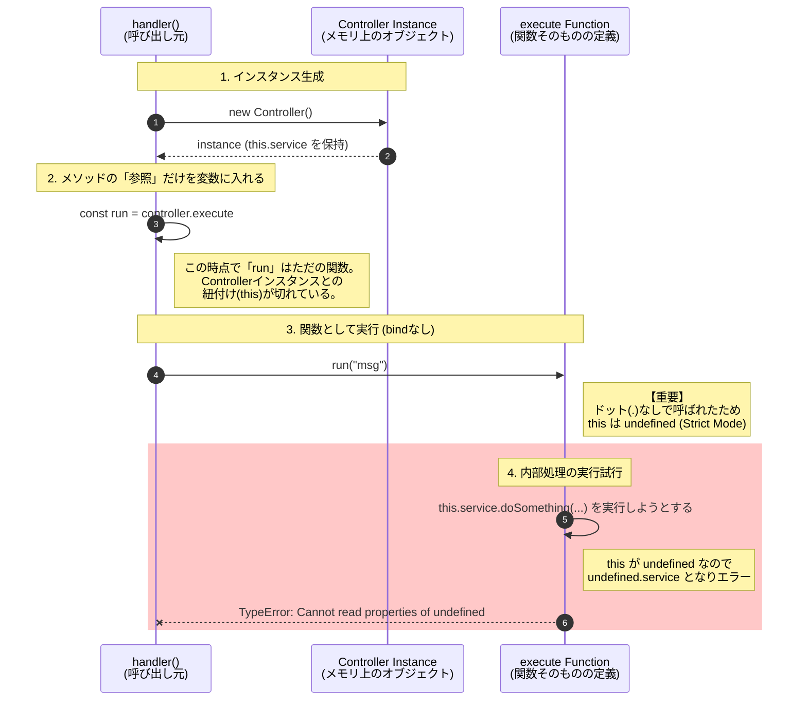
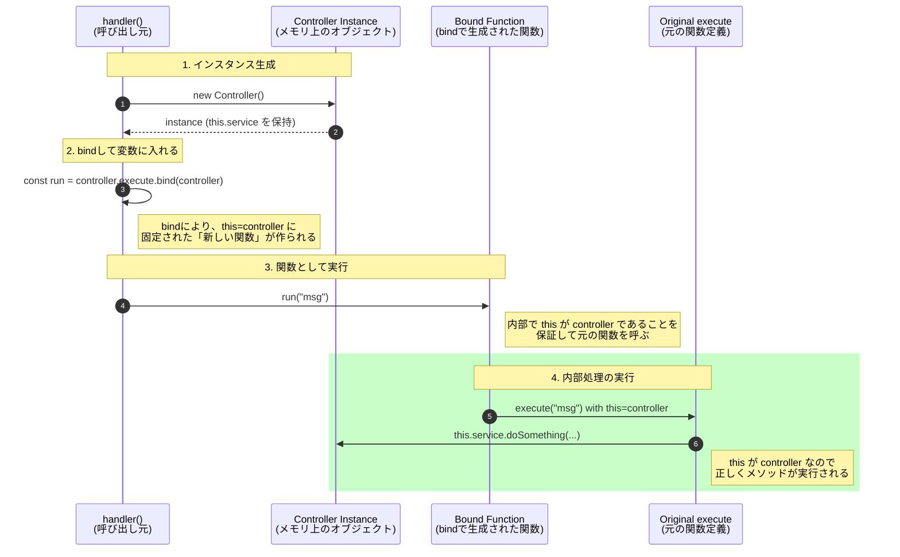

# bindメソッドの仕組みについて解説

`Controller` クラス内では `this.service` を使用しています。
しかし、`handler.ts` でメソッドを変数に代入して実行すると、`this` の情報が失われます。

## bindありのライフサイクル

`bind(controller)` を行うと、元の関数をラップし、`this` を固定した「新しい関数」が生成されます。

